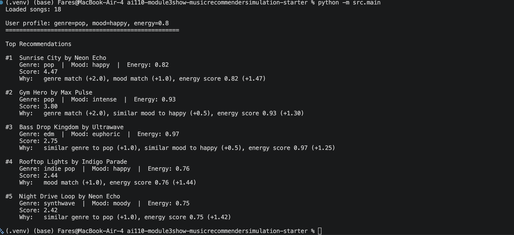

# 🎵 Music Recommender Simulation

## Project Summary

In this project you will build and explain a small music recommender system.

Your goal is to:

- Represent songs and a user "taste profile" as data
- Design a scoring rule that turns that data into recommendations
- Evaluate what your system gets right and wrong
- Reflect on how this mirrors real world AI recommenders

Replace this paragraph with your own summary of what your version does.

---

## How The System Works

Real-world recommenders like YouTube and Spotify run a two-stage pipeline: they first use collaborative filtering to find candidate content based on what similar users consumed, then rank those candidates using content features and personal behavior signals like watch time, skips, and likes. Our simulation cannot replicate that because we only have song attributes and no multi-user behavior data. Instead we use content-based filtering for a single simulated user — we define a user preference profile, score every song in the catalog against it using a weighted scoring system, and return the top k results ranked by score.

### Song Features

Each `Song` object stores:

**Categorical** — describes the type of song:
- `genre` (lofi, rock, pop, jazz, ambient, synthwave, indie pop, edm, hip-hop, country, funk, r&b, blues, classical, folk)
- `mood` (chill, happy, intense, relaxed, focused, moody, nostalgic, euphoric, melancholic, upbeat, playful, romantic, sad)
- `artist`
- `title`

**Numerical** — describes the feel of the song on a 0.0–1.0 scale:
- `energy` — how intense or loud
- `valence` — how positive or upbeat
- `danceability` — how rhythmically suited for dancing
- `acousticness` — how acoustic vs electronic
- `tempo_bpm` — beats per minute

### UserProfile Features

The `UserProfile` stores a manually defined preference dictionary that simulates what a real user's taste profile would look like after aggregating their listening history:
- `genre` and `mood` — categorical preferences
- `energy`, `valence`, `acousticness` — numerical target values between 0.0 and 1.0

### Scoring Strategy: Weighted Feature Scoring

Each song is scored against the user profile by awarding points per feature match. This approach was chosen over cosine similarity because it is fully explainable — every recommendation comes with a printed breakdown of exactly why that song scored high.

```
genre match      → +2.0 flat bonus  (strongest signal)
mood match       → +1.0 flat bonus  (secondary signal)
energy closeness → (1 - |user_energy - song_energy|) × 1.5   max 1.5
valence closeness→ (1 - |user_valence - song_valence|) × 1.0  max 1.0
acousticness     → (1 - |user_acousticness - song_acousticness|) × 0.5  max 0.5

max total score  → 6.0
```

Songs are ranked highest score first and the top k are returned. Each result includes a human-readable explanation such as:

```
Sunrise City - Score: 4.47
Because: genre match (+2.0), mood match (+1.0), energy score 0.82 (+1.47)
```

---

## Getting Started

### Setup

1. Create a virtual environment (optional but recommended):

   ```bash
   python -m venv .venv
   source .venv/bin/activate      # Mac or Linux
   .venv\Scripts\activate         # Windows

2. Install dependencies

```bash
pip install -r requirements.txt
```

3. Run the app:

```bash
python -m src.main
```

### Running Tests

Run the starter tests with:

```bash
pytest
```

You can add more tests in `tests/test_recommender.py`.

---

## Experiments You Tried

### CLI Verification

The simulation runs entirely from the terminal. Running `python -m src.main` loads all 18 songs, scores them against each user profile, and prints a ranked list with per-feature explanations.



---

### Standard Profiles

Three distinct user personas were tested to verify the scoring logic responds correctly to different tastes.

**High-Energy Pop** — genre=pop, mood=happy, energy=0.88


**Chill Lofi** — genre=lofi, mood=chill, energy=0.38


**Deep Intense Rock** — genre=rock, mood=intense, energy=0.92


---

### Edge Case Profiles

Three adversarial profiles were used to probe the limits of the scoring logic.

**High Energy + Sad Mood** — genre=blues, mood=sad, energy=0.90. The catalog has no high-energy blues songs, so the system defaults to Last Train despite the large energy mismatch. The +3.0 categorical floor from genre+mood exact match overrides the numerical penalty — a known limitation.


**Unknown Genre (bossa nova)** — genre not in catalog or any group, so all genre points are zero. The system falls back gracefully to mood and numerical features and still returns sensible results.


**All 0.5 Midpoint** — no numerical feature strongly penalizes any song, so categorical matches dominate. Night Drive Loop beats pop songs because mood exact match + genre group match equals the same categorical weight as a genre exact match alone.


### Weight Shift Experiment

Tested system sensitivity by doubling the energy weight (`×1.5 → ×3.0`) and halving the genre bonus (`+2.0 → +1.0`).

**What changed vs what just differed:**

- **Deep Intense Rock** — Gym Hero jumped from #5 → #2. It has `mood=intense` exact match and `energy=0.93` nearly identical to target `0.92`. Previously the genre group bonus for other songs pushed them ahead despite worse energy fits. With higher energy weight, the right song surfaced — a genuine accuracy improvement.

- **High Energy + Sad edge case** — Storm Runner (energy=0.91, no genre/mood match) jumped to #2 purely on energy closeness. A sad blues user would not want Storm Runner. Energy weight being too high broke genre coherence for this profile.

**Conclusion:** Genre acts as a coherence anchor. Reducing its weight makes the system more energy-accurate for straightforward profiles but allows numerically similar yet genre-incompatible songs to surface for edge cases. A fixed weight for all users is the underlying limitation — a real system would let users signal which feature matters most to them.

---

## Limitations and Risks

Summarize some limitations of your recommender.

Examples:

- It only works on a tiny catalog
- It does not understand lyrics or language
- It might over favor one genre or mood

You will go deeper on this in your model card.

---

## Reflection

Read and complete `model_card.md`:

[**Model Card**](model_card.md)

Write 1 to 2 paragraphs here about what you learned:

- about how recommenders turn data into predictions
- about where bias or unfairness could show up in systems like this


---

## 7. `model_card_template.md`

Combines reflection and model card framing from the Module 3 guidance. :contentReference[oaicite:2]{index=2}  

```markdown
# 🎧 Model Card - Music Recommender Simulation

## 1. Model Name

Give your recommender a name, for example:

> VibeFinder 1.0

---

## 2. Intended Use

- What is this system trying to do
- Who is it for

Example:

> This model suggests 3 to 5 songs from a small catalog based on a user's preferred genre, mood, and energy level. It is for classroom exploration only, not for real users.

---

## 3. How It Works (Short Explanation)

Describe your scoring logic in plain language.

- What features of each song does it consider
- What information about the user does it use
- How does it turn those into a number

Try to avoid code in this section, treat it like an explanation to a non programmer.

---

## 4. Data

Describe your dataset.

- How many songs are in `data/songs.csv`
- Did you add or remove any songs
- What kinds of genres or moods are represented
- Whose taste does this data mostly reflect

---

## 5. Strengths

Where does your recommender work well

You can think about:
- Situations where the top results "felt right"
- Particular user profiles it served well
- Simplicity or transparency benefits

---

## 6. Limitations and Bias

Where does your recommender struggle

Some prompts:
- Does it ignore some genres or moods
- Does it treat all users as if they have the same taste shape
- Is it biased toward high energy or one genre by default
- How could this be unfair if used in a real product

---

## 7. Evaluation

How did you check your system

Examples:
- You tried multiple user profiles and wrote down whether the results matched your expectations
- You compared your simulation to what a real app like Spotify or YouTube tends to recommend
- You wrote tests for your scoring logic

You do not need a numeric metric, but if you used one, explain what it measures.

---

## 8. Future Work

If you had more time, how would you improve this recommender

Examples:

- Add support for multiple users and "group vibe" recommendations
- Balance diversity of songs instead of always picking the closest match
- Use more features, like tempo ranges or lyric themes

---

## 9. Personal Reflection

A few sentences about what you learned:

- What surprised you about how your system behaved
- How did building this change how you think about real music recommenders
- Where do you think human judgment still matters, even if the model seems "smart"

